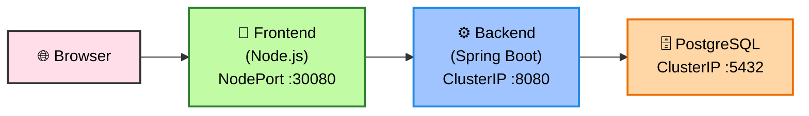

# Banking Application - DevOps Assignment-01

A multi-tier banking application deployed on Kubernetes (Minikube).

## 🧰 Tech Stack

| Layer            | Technology 🚀                                 | Description 📄                             | Port 🔌 |
| ---------------- | --------------------------------------------- | ------------------------------------------ | ------- |
| 🎨 Frontend      | **Node.js (Express + EJS)**                   | Server-side rendered UI with dynamic views | `3000`  |
| ⚙️ Backend       | **Java 17 + Spring Boot 3 + Spring Data JPA** | REST API & business logic layer            | `8080`  |
| 🗄️ Database     | **PostgreSQL 15**                             | Relational database for persistent storage | `5432`  |

## Architecture
```
Browser → Frontend (NodePort :30080) → Backend (ClusterIP :8080) → PostgreSQL (ClusterIP :5432)
```
## 🌈 Architecture Diagram



---

## 🧭 Flow Explanation

* 🌐 **Browser** → Accesses application via NodePort
* 🎨 **Frontend (Node.js)** → Handles UI & sends API requests
* ⚙️ **Backend (Spring Boot)** → Processes business logic
* 🗄️ **PostgreSQL** → Stores and retrieves data

---


---


## Prerequisites
- Kubernetes Cluster
- kubectl CLI
- Docker Hub Account

## Quick Start

### 1. Create the Kubernetes Cluster of your choice
```bash
- Minikube
- Kubeadm
- EKS
- AKS
- GKE
```

### 2. Build & Push Docker Images
```bash
# Build images
docker build -t YOUR_USERNAME/banking-backend:v1 ./backend
docker build -t YOUR_USERNAME/banking-frontend:v1 ./frontend

# Push to Docker Hub
docker login
docker push YOUR_USERNAME/banking-backend:v1
docker push YOUR_USERNAME/banking-frontend:v1
```

### 3. Update K8s Manifests
Replace `YOUR_USERNAME` in these files with your Docker Hub username:
- `k8s/backend-deployment.yaml`
- `k8s/frontend-deployment.yaml`

### 4. Deploy to Kubernetes
```bash
# Create namespace
kubectl apply -f k8s/namespace.yaml

# Create Database related kubernetes resources
kubectl apply -f k8s/postgres-pvc.yaml
kubectl apply -f k8s/postgres-secret.yaml
kubectl apply -f k8s/postgres-service.yaml
kubectl apply -f k8s/postgres-deployment.yaml
kubectl wait --for=condition=ready pod -l app=postgres -n banking-app --timeout=120s

# Create backend related kubernetes resources
kubectl apply -f k8s/backend-configmap.yaml
kubectl apply -f k8s/backend-deployment.yaml
kubectl apply -f k8s/backend-service.yaml
kubectl wait --for=condition=ready pod -l app=backend -n banking-app --timeout=180s

# Create frontend related kubernetes resources
kubectl apply -f k8s/frontend-configmap.yaml
kubectl apply -f k8s/frontend-service.yaml
kubectl apply -f k8s/frontend-deployment.yaml
kubectl wait --for=condition=ready pod -l app=backend -n banking-app --timeout=180s

```

### 5. Access the Application
```bash
minikube service frontend -n banking-app
```

## Cleanup
```bash
kubectl delete namespace banking-app
minikube stop
```
