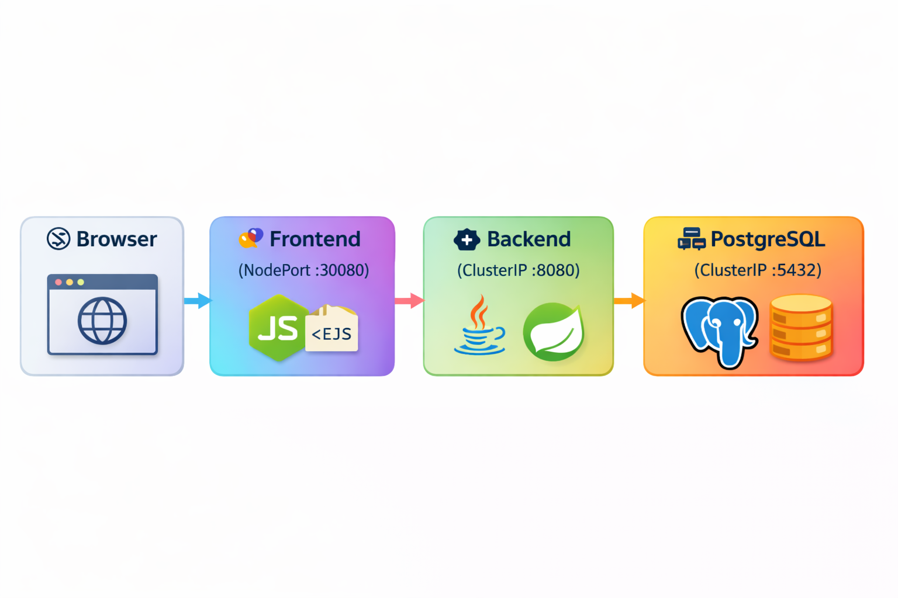

# Banking Application - DevOps Assignment-01

A multi-tier Banking Application deployed on Kubernetes Cluster.

## 🧰 Tech Stack

<div align="center">

|     🎯 Layer     | 🚀 Technology                                    | 📄 Description                             |      🔌 Port      |
| :--------------: | ------------------------------------------------ | ------------------------------------------ | :---------------: |
|  🎨 **Frontend** | <b>Node.js (Express + EJS)</b>                   | Server-side rendered UI with dynamic views | <code>3000</code> |
|  ⚙️ **Backend**  | <b>Java 17 + Spring Boot 3 + Spring Data JPA</b> | REST APIs & business logic processing      | <code>8080</code> |
| 🗄️ **Database** | <b>PostgreSQL 15</b>                             | Reliable relational database for storage   | <code>5432</code> |

</div>

---

## Architecture
```
Browser → Frontend (NodePort :30080) → Backend (ClusterIP :8080) → PostgreSQL (ClusterIP :5432)
```

## 🏗️ Architecture Diagram  
  

## 🧭 Flow Explanation
* 🌐 **Browser** → Accesses application via NodePort
* 🎨 **Frontend (Node.js)** → Handles UI & sends API requests
* ⚙️ **Backend (Spring Boot)** → Processes business logic
* 🗄️ **PostgreSQL** → Stores and retrieves data

---
## Prerequisites
- Kubernetes Cluster
- kubectl CLI
- Docker Hub Account

## Quick Start

### 1. Create the Kubernetes Cluster of your choice
```bash
- Minikube
- Kubeadm
- EKS
- AKS
- GKE
```

### 2. Build & Push Docker Images
```bash
# Build images
docker build -t YOUR_USERNAME/banking-backend:v1 ./backend
docker build -t YOUR_USERNAME/banking-frontend:v1 ./frontend

# Push to Docker Hub
docker login
docker push YOUR_USERNAME/banking-backend:v1
docker push YOUR_USERNAME/banking-frontend:v1
```

### 3. Update K8s Manifests
Replace `YOUR_USERNAME` in these files with your Docker Hub username:
- `k8s/backend-deployment.yaml`
- `k8s/frontend-deployment.yaml`

### 4. Deploy to Kubernetes
```bash
# Create namespace
kubectl apply -f k8s/01-namespace.yaml

# Create Database related kubernetes resources
kubectl apply -f k8s/02-postgres-pvc.yaml
kubectl apply -f k8s/03-postgres-secret.yaml
kubectl apply -f k8s/04-postgres-service.yaml
kubectl apply -f k8s/05-postgres-deployment.yaml
kubectl wait --for=condition=ready pod -l app=postgres -n banking-app --timeout=120s

# Create backend related kubernetes resources
kubectl apply -f k8s/06-backend-configmap.yaml
kubectl apply -f k8s/07-backend-service.yaml
kubectl apply -f k8s/08-backend-deployment.yaml
kubectl wait --for=condition=ready pod -l app=backend -n banking-app --timeout=180s

# Create frontend related kubernetes resources
kubectl apply -f k8s/09-frontend-configmap.yaml
kubectl apply -f k8s/10-frontend-service.yaml
kubectl apply -f k8s/11-frontend-deployment.yaml
kubectl wait --for=condition=ready pod -l app=backend -n banking-app --timeout=180s

```

### 5. Access the Application
```bash
http://<PUBLIC-IP>:<NODEPORT>

http://<PUBLIC-IP>:30080
```

## 🧹 Clean Up
```bash
kubectl delete namespace banking-app
```
